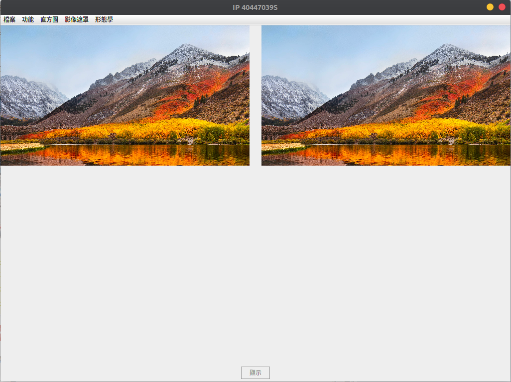

# ImageProcessing

## **NTNU**

- Feature
	- GUI
		- Bar design
	- JAVA

- HW1 R/W Image Files
	- Supported: JPG, BMP, PPM
	- After reading image, you can display on right side.
- HW2 Interpolation
	- Input
		- Resize to n
- HW3 Affine && Rotate
	- Input
		- move x and y
		- Rotate r angle
- HW4 Gray-scale Equalization Histogram
- HW5 Convolution && Edge detection
	- You can decide the matrix size and value 
		- Only convolution
		- If the size is too big, then the program may be very slow or crash
	- Edge detection will remind you to meet the requirement
- HW6 Fourier Transform
	- It is done by python.
	- Just Google it.
- HW7 Choose and show specific color
	- You can do this with clicking mouse on left side image then display on right side.
- HW8 Gray-scale erosion && dilation
	- It reuse some code.
